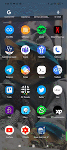

# StreamPlayerApp

<h3 align="center">
  

</h3>

## 🇺🇸 English Version ↙️

🇺🇸 If you speak English, take a look [here](./README.md) 🇺🇸

## 🎯 Sobre o Projeto

O projeto StreamPlayerApp é um clone do Netflix, desenvolvido de forma colaborativa e gratuita para a comunidade. O objetivo é proporcionar uma experiência de aprendizado e prática de programação, além de servir como uma plataforma de mentoria. Por causa disso estaremos utilizando todas as tecnologias mais atuais de desenvolvimento android como:

**Flow, Compose, Koin, NavigationCompose, Arquitetura MVVM com clean architecture entre outras ( ainda será separado um link para isso)**

## 🏋️‍♀️ Motivação

Este projeto foi iniciado com o propósito de fornecer uma oportunidade de aprendizado prático e colaborativo para a comunidade. Através dele, os participantes podem aprimorar suas habilidades em desenvolvimento Android, Kotlin, arquitetura de aplicativos e trabalho em equipe.

## 💬 Comunicação

Toda a comunicação desse grupo será feita no nosso grupo do [Discord](https://discord.gg/fZMDmjKmju) no canal [#projeto-netflix](https://discord.com/channels/843114243859546142/1101921493010616351))

---

### 🚨 Ahhhhhh se você esta entrando nesse repo, ou sendo mento(ra/r) ou sendo mentorad(a/o) ou passando aqui por a caso só para pegar um café ☕ e ainda não se inscreveu no canal, inscreva-se 🙏

Acompanhe a série [Projeto Netflix](https://www.youtube.com/playlist?list=PL-7tME9TKyA4At5ze9i8-w_trk7nXMGRj) que é um conteúdo originado deste repositório

---

## ✨ Como Contribuir

Se você deseja contribuir para o projeto veja, qual cenário que se adeque melhor a você:

1. Caso você queira aprender algo ou quer explorar o processo de mentoria ou está na dúvida sobre o que pegar.
   - Fale com um dos membros apoiadores no grupo do [Discord](https://discord.gg/fZMDmjKmju), no canal [#projeto-netflix](https://discord.com/channels/843114243859546142/1101921493010616351)(Rods, Gabriel Moro ou Carlos Vaccari), para ajudar a instruí-l(a/o).
   - Essa parte da dinâmica da mentoria será moldada junto com você, logo não sabemos como vai ser na pratica 😊, então tente/tenha paciência e vamos aprender juntos!
   - O objetivo é utilizar o discord como principal meio de comunicação
2. Caso você queira ajudar a galera no processo de mentoria.

   - Fale com um dos membros apoiadores no grupo do Discord, no canal #projeto-netflix, e participe ajudando o pessoal lá.
   - Entre em contato conosco no [Discord](https://discord.gg/fZMDmjKmju) com Rods, Gabriel Moro ou Carlos Vaccari.

3. Caso você esteja apenas procurando um pretexto para codar, fazer alguma melhoria ou porque não pegar algo divertido para fazer!

   - Siga o resto dos [passos](https://github.com/CodandoTV/StreamPlayerApp/blob/master/CONTRIBUTOR_PROJECT.md) e seja bem-vindo!

4. Caso tenha sentido falta de algo que não está mapeando, crie uma issue e fale com nossos membros apoiadores;

5. Quer gravar vídeo no CodandoTV do que você fez?
   - Fale com Rods! [Discord](https://discord.gg/fZMDmjKmju) / [LinkedIn](https://www.linkedin.com/in/rviannaoliveira/)

Para todas as condições de contribuições do repo, a continuação está no [Passo a Passo Completo](https://github.com/CodandoTV/StreamPlayerApp/blob/master/CONTRIBUTOR_PROJECT.md)

---

## 🗺️ Como usar nossa WIKI (sétima aba do projeto do git)

A ideia que a nossa wiki fique cade vez mais rica, então será um processo continuo.
Lá estarão listadas, nossas tecnologias, e motivadores e mais alguma coisa que acharmos relevante.

Se vc achou que faltou algo relevante ali, fique a vontade e faça um PR para wiki também!
[Passo a Passo](https://github.com/CodandoTV/StreamPlayerApp/blob/master/CONTRIBUTOR_WIKI.md)

---

## 🎤 Como usar a opção Discussions (quarta aba do projeto do git)

Pode ser que existam threads no discord interminaveis e as vezes a comunicação como em qualquer empresa tem uma falha, imagina um projeto que fazemos no nosso tempo vago.

Criei um `discussions` e la além de ficar no histórico, se quiser olhar o exemplo [Discussion](https://github.com/CodandoTV/StreamPlayerApp/discussions/48), podemos fazer threads mais longas e tudo guardado para as pessoas verem, parecido com as threads do `reddit` vamos ver se funciona bem isso, contamos com sua compreensão e apoio.

---

## 👀 Quer ver como esta ficando?

---

### Se você chegou ate aqui na leitura, se inscreva no canal 😛 [Codandotv](https://bit.ly/3Ob3yPH)

## Contribuidores

Este projeto existe graças a todas as pessoas que contribuem.

## 🤖 Desenvolvimento Assistido por IA

Este projeto utiliza o [opencode](https://opencode.ai) como assistente de codificação com IA. A configuração está centralizada nos seguintes arquivos:

### AGENTS.md

Referenciado pelo `opencode.json` como arquivo de instruções (`"instructions": ["AGENTS.md"]`), fornece ao agente de IA o contexto completo do projeto — incluindo visão geral, sistema de build (Gradle 9.3.1, Kotlin 2.3.20), estrutura de módulos, dependências principais, gerenciamento de versão, CI e convenções de contribuição.

### opencode.json

Arquivo raiz de configuração que orquestra a assistência de IA:

| Configuração | Valor |
|---|---|
| Instructions | `AGENTS.md` |
| Skills path | `.opencode/skills/` |

### Skills (Habilidades)

Skills personalizadas estão em `.opencode/skills/`. Atualmente disponível:

- **open-pr** — Automatiza a criação de PRs no GitHub comparando a branch atual com a `master`, gerando a descrição do PR em português brasileiro.

### MCPs (Model Context Protocol)

MCPs estendem as capacidades da IA com ferramentas externas. Atualmente configurados:

| MCP | Tipo | Propósito |
|---|---|---|
| [Kotzilla](https://kotzilla.io) | Remoto | Monitoramento de performance, diagnóstico de dependências (Koin), análise de startup/ANR/crashes |
| [Maestro](https://maestro.mobile.dev) | Local (`maestro mcp`) | Automação de testes de UI mobile e interação com dispositivos |

## License

    Copyright 2023 Rodrigo Vianna

    Licensed under the Apache License, Version 2.0 (the "License");
    you may not use this file except in compliance with the License.
    You may obtain a copy of the License at

    http://www.apache.org/licenses/LICENSE-2.0

    Unless required by applicable law or agreed to in writing, software
    distributed under the License is distributed on an "AS IS" BASIS,
    WITHOUT WARRANTIES OR CONDITIONS OF ANY KIND, either express or implied.
    See the License for the specific language governing permissions and
    limitations under the License.
